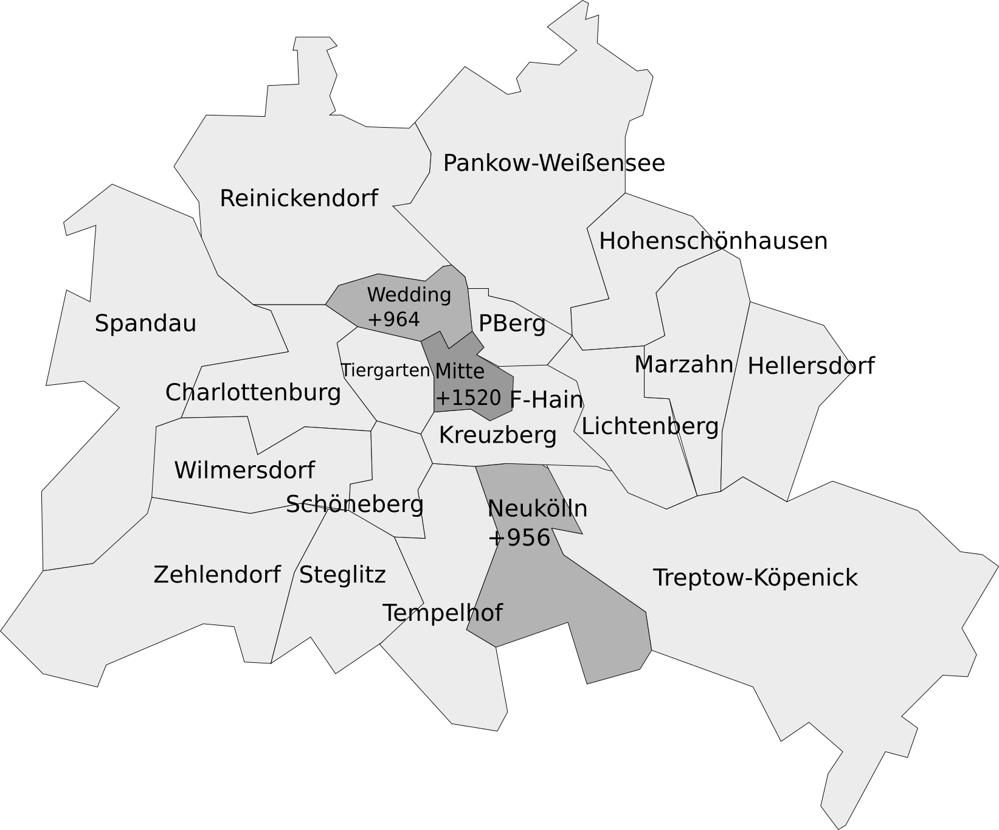
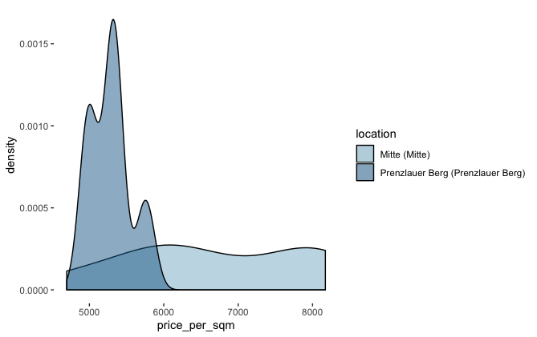
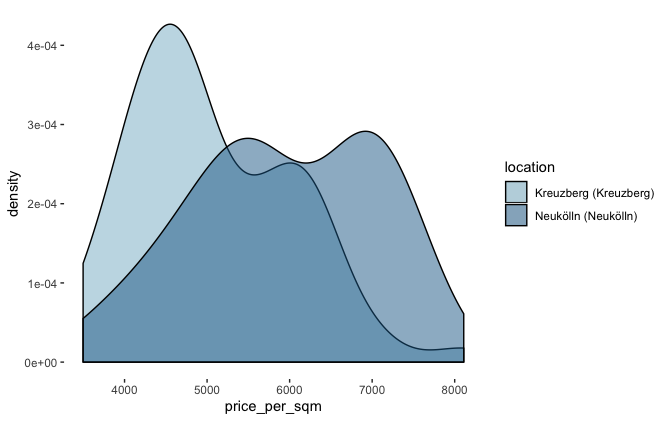
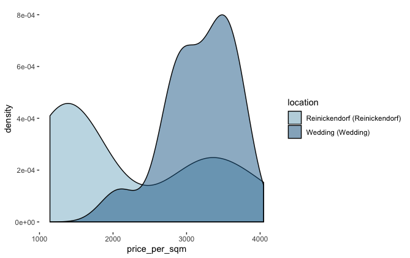

[](http://quantlet.de/)

## [](http://quantlet.de/) **DEDA2019_BerlinHousePriceMarkUp** [](http://quantlet.de/)

```yaml

Name of QuantLet : DEDA2019_BerlinHousePriceMarkUp

Published in : 'DEDA Class 2019'

Description : 'Computes densities of house prices among the districts of Berlin and thereby identifies the local price mark-up due to the reputation of the district.'

Keywords : 'Berlin, real estate, house prices, price mark-up,density estimation, '

Author : 'Konstantin Häusler and Hamid Mostofi'

Submitted: 'February 09 2020, Konstantin Häusler'

```









### R Code
```r

data <- read.csv("full_data.csv")

#data preparation
library(dplyr)
nums <- unlist(lapply(data, is.numeric))
data_num <- data[, nums]
binary <- c("balcony", "built_in_kitchen", "cellar", "courtage", "garden", "is_vacant",
            "lift", "private_seller")
data_num1 <- data_num[, ! names(data_num) %in% binary]

#some descriptive statistics
boxplot(data$price)     # need to remove outliers (or take logs())

#remove outliers
remove_outliers <- function(x, na.rm = TRUE, ...) {
  qnt <- quantile(x, probs=c(.25, .75), na.rm = na.rm, ...)
  H <- 1.5 * IQR(x, na.rm = na.rm)
  y <- x
  y[x < (qnt[1] - H)] <- NA
  y[x > (qnt[2] + H)] <- NA
  y
}
data <- data[!is.na(data$price),]
boxplot(data$price)

#------------------------------------------------------------------------------------------
#which areas are suitable (= contain enough observations) for RD analysis?
n <- table(data$location)
df <- data[data$location %in% names(n[n >100]), ]
count(df$location)


#select area Reinickendorf-Wedding 
data.rw <- data[data$lat > 52.5570 & data$lat < 52.569 & 
               data$lng > 13.320 & data$lng < 13.370 , ]
count(data.rw$location)   #31 Reinickendorf, 13 Wedding, naja
PriLoc <- data.rw[data.rw$price < 500000, c("price_per_sqm", "location")]

#density plots
library(ggplot2)
ggplot(PriLoc, aes(price_per_sqm, fill = location)) + geom_density(alpha = 0.5) + scale_fill_manual(values= c("#85B8CD", "#1D6A96")) + theme(panel.background = element_blank())

# Spatial Regression Discontinuity
data.rw$wedding <- ifelse(data.rw$location =="Wedding (Wedding)", 1,0) #creates dummy for Wedding

reg.1 <- lm(formula = price_per_sqm ~ wedding
            , data = data.rw)
summary(reg.1)

reg.2 <- lm(formula = price_per_sqm ~ wedding+ is_vacant+ courtage + 
              grocery_rating_score + built_in_kitchen +
              park_weighted_average_rating + park_total_activity +
              education_distance_university + education_distance_kita +
              cellar + education_distance_adult_education
            , data = data.rw)
summary(reg.2)


#in the following the same procedure for other districts:

#Prenzlberg Mitte *
data.pm <- data[data$lat > 52.530 & data$lat < 52.540 & 
                  data$lng > 13.400 & data$lng < 13.411 , ]
data.pm <- data.pm[data.pm$price_per_sqm<10000 & data.pm$price_per_sqm > 4500,]
count(data.pm$location)
PriLoc.pm <- data.pm[, c("price_per_sqm", "location")]
ggplot(PriLoc.pm, aes(price_per_sqm, fill = location)) + geom_density(alpha = 0.5) + scale_fill_manual(values= c("#85B8CD", "#1D6A96")) + theme(panel.background = element_blank())
data.pm$mitte <- ifelse(data.pm$location =="Mitte (Mitte)", 1,0) #creates dummy for Mitte
reg.pm <- lm(formula = price_per_sqm ~ mitte
            , data = data.pm)
summary(reg.pm)

#kreuzberg Neukölln *
data.kn <- data[data$lat > 52.486 & data$lat < 52.496 & 
                    data$lng > 13.415 & data$lng < 13.441 , ]
count(data.kn$location)
PriLoc.kn <- data.kn[, c("price_per_sqm", "location")]
#denisities
ggplot(PriLoc.kn, aes(price_per_sqm, fill = location)) + geom_density(alpha = 0.5) + scale_fill_manual(values= c("#85B8CD", "#1D6A96")) + theme(panel.background = element_blank())
data.kn$neukölln <- ifelse(data.kn$location =="Neukölln (Neukölln)", 1,0) #creates dummy for Wedding
m.kn <- aggregate(data.kn$price_per_sqm, by= list(data.kn$location), FUN=mean)
m.kn
reg.kn <- lm(formula = price_per_sqm ~ neukölln
            , data = data.kn)
summary(reg.kn)

#-----------------------------------------------------------------------------------------
# Friedrichshain Lichtenberg
data.fl <- data[data$lat > 52.500 & data$lat < 52.513 & 
                  data$lng > 13.471 & data$lng < 13.484 , ]

#Steglitz-Lichterfelde
data.sl <- data[data$lat > 52.442 & data$lat < 52.455 & 
                  data$lng > 13.312 & data$lng < 13.326 , ]
count(data.sl$location)

#Kreuzberg Schöneberg
data.ks <- data[data$lat > 52.491 & data$lat < 52.495 & 
                  data$lng > 13.364 & data$lng < 13.375 , ]


```

automatically created on 2020-02-10